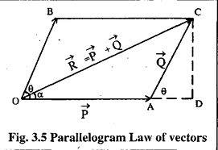

## <u>Experiment No. 1</u>

# PARALLELOGRAM LAW OF FORCES
## AIM:
### To verify the Parallelogram Law of Forces
------- 
## Apparatus:
### Drawing sheet, pins, mirrors, weight pan, weights and pulleys.
------- 
## Theory:
### The parallelogram law of forces enables us to determine the single force called resultant which can replace the two forces acting at a point with the same effect as that of the two forces. This law was formulated based on experimental results. This law states that if two forces acting simultaneously on a body at a point are represented in magnitude and direction by the two adjacent sides of a parallelogram, their resultant is represented in magnitude and direction by the diagonal of the parallelogram which passes through the point of intersection of the two sides representing the forces
------- 
## Procedure:
> 1. Two pulleys are mounted on a board, which is fixed on a wall. A string is passed through both the pulleys. Another string is tied to this string at the center of the pulleys. Weight pans are attached to the two ends of the string

> 2. Fix a drawing sheet on the board. Add weights in any two pans in such a way that the sum of the weights in any two pans is greater than the third. The system of forces will come to equilibrium on some part of the drawing sheet.

> 3. Take a mirror and place it behind the strings. Mark the images of the strings on the drawing sheet. Remove the drawing sheet and find the resultant of the two forces graphically and analytically.

> 4. Change the weights and repeat the procedure for each set
------- 

| Force(in grams) | Resultant R Graphically | Angle Between P and Q | Resultant R analytically |
| ----------------| ----------------------- | ----------------------| -------------------------|
| 350             | 2.95 x 50 = 147.5       |119˚                   |152.25                    |
| 450             | 3.4 x 50 = 34.4         |120˚                   |455                       |
------- 
## Diagram to illustrate Parallelogram Law of Forces

